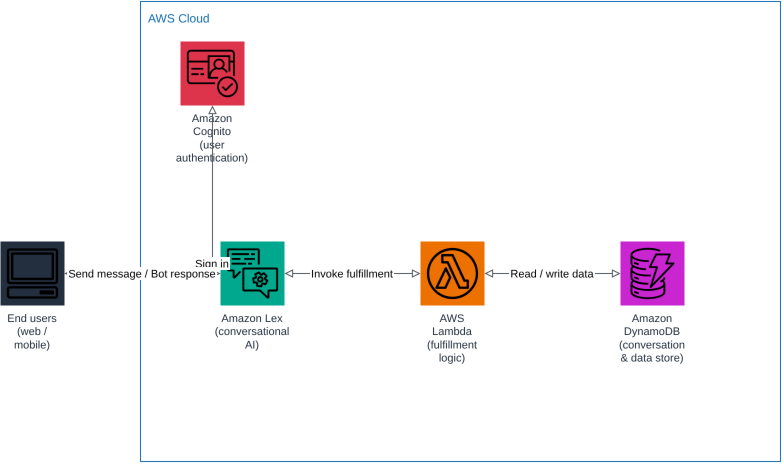

# AWS Chatbot Architecture Diagram

A simple, end-to-end reference architecture for deploying a conversational chatbot on AWS.



## Components

| Component | Role |
|---|---|
| **End users (web / mobile)** | Entry point — the client the user interacts with to chat with the bot. |
| **Amazon Cognito** | Authenticates end users before they can start a chat session. |
| **Amazon Lex** | Conversational AI service — handles natural language understanding, intent recognition, and dialog management. |
| **AWS Lambda** | Compute layer that implements the bot's business logic (fulfillment) when Lex resolves an intent. |
| **Amazon DynamoDB** | Storage layer for conversation history and any data the bot needs to read or write. |

## Request / response flow

1. The end user opens the web/mobile client and signs in through **Amazon Cognito**.
2. The client sends the user's message to **Amazon Lex**, which interprets the intent and manages the conversation state.
3. When Lex needs to fulfill an intent (e.g. look up an order, answer a question), it invokes **AWS Lambda**.
4. Lambda reads or writes the data it needs in **Amazon DynamoDB** and returns the result to Lex.
5. Lex sends the final response back to the client, which displays it to the end user.

## Why this architecture is simple

- Only one entry point (the client) and one conversational AI service (Lex) — no extra API layers.
- A single Lambda function handles all fulfillment logic.
- A single DynamoDB table covers storage needs.
- Cognito is the only supporting service beyond compute/storage, keeping authentication decoupled from the bot logic.

## Diagram source

The diagram is generated as an editable draw.io file at [docs/architecture.drawio](docs/architecture.drawio), with rendered [SVG](docs/architecture.svg) and [PNG](docs/architecture.png) exports for embedding.

To regenerate it:

```bash
python3 -m venv .diagram-venv
.diagram-venv/bin/pip install drawpyo
.diagram-venv/bin/python scripts/generate_diagram.py

# Rasterize to SVG/PNG
docker run --rm -v "$PWD/docs":/data -w /data rlespinasse/drawio-export -f svg -o . --output-mode relative --remove-page-suffix .
docker run --rm -v "$PWD/docs":/data -w /data rlespinasse/drawio-export -f png -o . --output-mode relative --remove-page-suffix -t .
```
