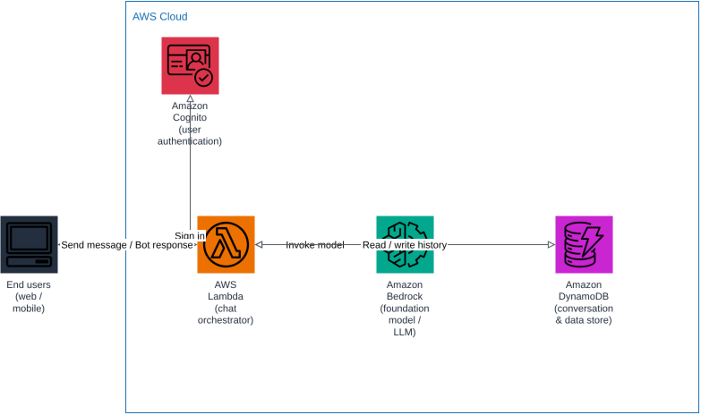

# AWS Chatbot Architecture Diagram

A simple, end-to-end reference architecture for deploying a conversational chatbot on AWS.

Two variants are included:

- [Lex-based](#variant-1-amazon-lex) — intent-driven conversational AI with Amazon Lex.
- [Bedrock/LLM-based](#variant-2-amazon-bedrock--llm) — generative AI chatbot powered by a foundation model on Amazon Bedrock.

## Variant 1: Amazon Lex


### Components

| Component | Role |
|---|---|
| **End users (web / mobile)** | Entry point — the client the user interacts with to chat with the bot. |
| **Amazon Cognito** | Authenticates end users before they can start a chat session. |
| **Amazon Lex** | Conversational AI service — handles natural language understanding, intent recognition, and dialog management. |
| **AWS Lambda** | Compute layer that implements the bot's business logic (fulfillment) when Lex resolves an intent. |
| **Amazon DynamoDB** | Storage layer for conversation history and any data the bot needs to read or write. |

### Request / response flow

1. The end user opens the web/mobile client and signs in through **Amazon Cognito**.
2. The client sends the user's message to **Amazon Lex**, which interprets the intent and manages the conversation state.
3. When Lex needs to fulfill an intent (e.g. look up an order, answer a question), it invokes **AWS Lambda**.
4. Lambda reads or writes the data it needs in **Amazon DynamoDB** and returns the result to Lex.
5. Lex sends the final response back to the client, which displays it to the end user.

## Variant 2: Amazon Bedrock + LLM



Use this variant when you want open-ended, generative responses instead of Lex's intent/slot-driven dialog model.

### Components

| Component | Role |
|---|---|
| **End users (web / mobile)** | Entry point — the client the user interacts with to chat with the bot. |
| **Amazon Cognito** | Authenticates end users before they can start a chat session. |
| **AWS Lambda** | Chat orchestrator — receives the user's message, calls the model, and returns the response. |
| **Amazon Bedrock** | Hosts the foundation model (LLM) that generates the bot's replies. |
| **Amazon DynamoDB** | Storage layer for conversation history, used to give the model conversational context. |

### Request / response flow

1. The end user opens the web/mobile client and signs in through **Amazon Cognito**.
2. The client sends the user's message to **AWS Lambda**, which acts as the chat orchestrator.
3. Lambda invokes **Amazon Bedrock** with the message (and recent history) to generate a response from the foundation model.
4. Lambda reads/writes the conversation history in **Amazon DynamoDB**.
5. Lambda returns the model's response to the client, which displays it to the end user.

### State management (DynamoDB)

Bedrock is stateless — it only sees whatever is in the prompt of a single `InvokeModel` call. So conversation state (what was said so far) has to live somewhere else, and DynamoDB is that place:

- **Partition key**: `sessionId` (one per conversation — e.g. a UUID the client generates at chat start, or `userId` if you only need one active conversation per user).
- **Sort key**: `timestamp` (or a monotonically increasing `turnId`) — lets you store one item per message and query them back in order.
- **Attributes per item**: `role` (`user` / `assistant`), `message` (the text), and optionally `tokens` if you want to track prompt-size growth.
- **TTL attribute**: e.g. `expiresAt`, so DynamoDB automatically deletes old sessions instead of growing forever.

On each request, the Lambda orchestrator:

1. Queries DynamoDB for the last *N* items (or last *K* tokens) for that `sessionId`.
2. Builds the prompt for Bedrock as `[system prompt] + [retrieved history] + [new user message]`.
3. After getting the model's reply, writes **both** the user message and the assistant reply back to DynamoDB as new items, so the next turn can see them.

This keeps state management simple (one table, one query, one write) while avoiding unbounded prompt growth — you cap how much history you pull back per turn, and let TTL clean up finished/abandoned sessions.

## Why these architectures are simple

- Only one entry point (the client) and one conversational AI service — no extra API layers.
- A single Lambda function handles all orchestration/fulfillment logic.
- A single DynamoDB table covers storage needs.
- Cognito is the only supporting service beyond compute/storage, keeping authentication decoupled from the bot logic.

## Diagram source

Each variant is generated as an editable draw.io file, with rendered SVG/PNG exports for embedding:

- Lex variant: [docs/architecture.drawio](docs/architecture.drawio) / [SVG](docs/architecture.svg) / [PNG](docs/architecture.png)
- Bedrock variant: [docs/architecture-bedrock.drawio](docs/architecture-bedrock.drawio) / [SVG](docs/architecture-bedrock.svg) / [PNG](docs/architecture-bedrock.png)

To regenerate them:

```bash
python3 -m venv .diagram-venv
.diagram-venv/bin/pip install drawpyo

.diagram-venv/bin/python scripts/generate_diagram.py
.diagram-venv/bin/python scripts/generate_diagram_bedrock.py

# Rasterize to SVG/PNG
docker run --rm -v "$PWD/docs":/data -w /data rlespinasse/drawio-export -f svg -o . --output-mode relative --remove-page-suffix .
docker run --rm -v "$PWD/docs":/data -w /data rlespinasse/drawio-export -f png -o . --output-mode relative --remove-page-suffix -t .
```
